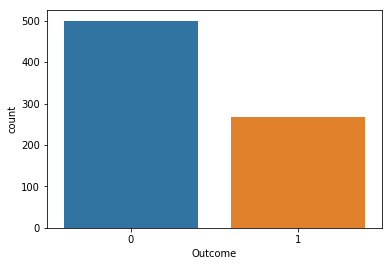
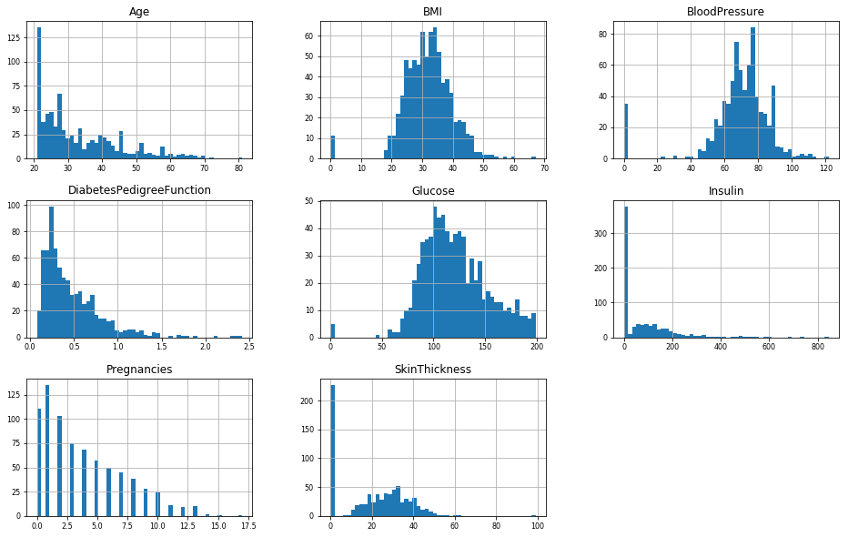
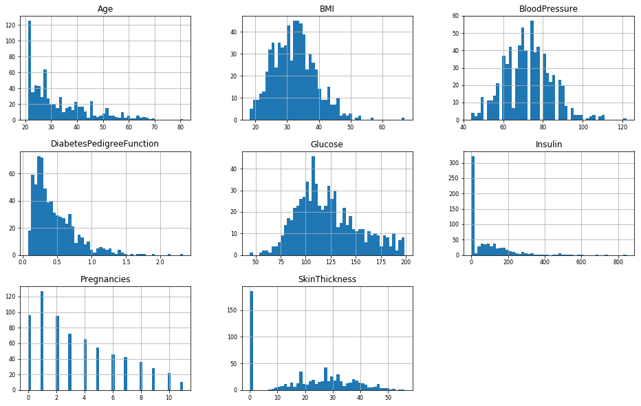
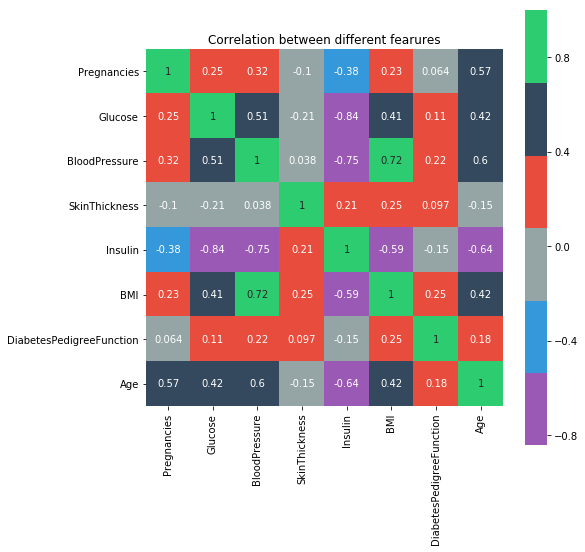
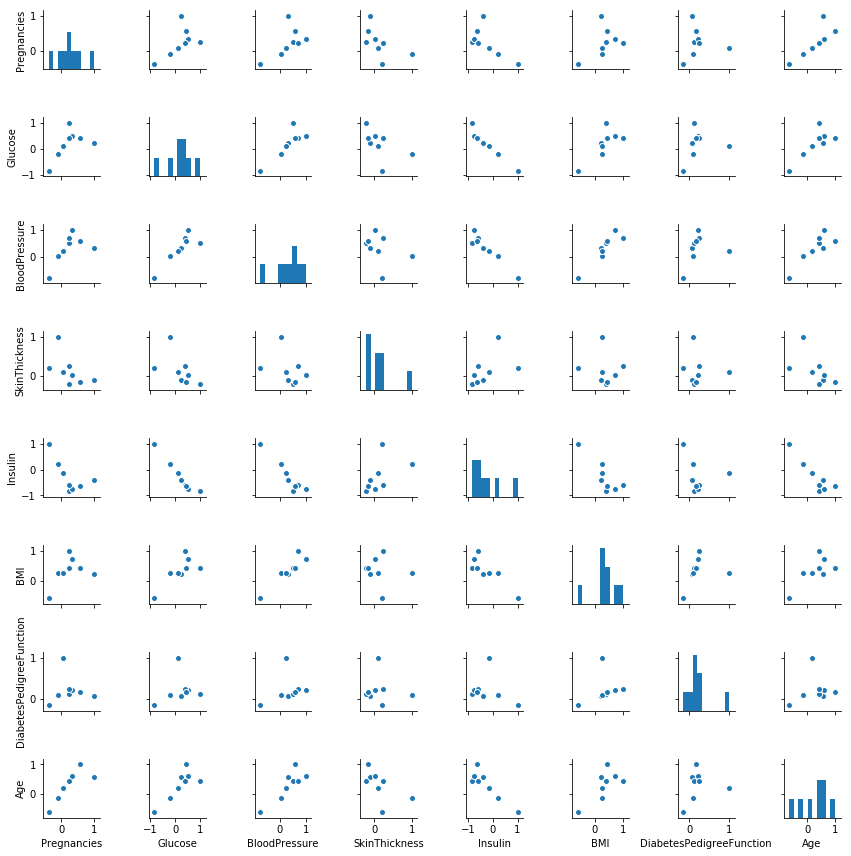

### Machine Learning For Diabetes ###


- uci machine learning diabetes dataset used for predicition


```python
import pandas as pd
import numpy as np
import matplotlib.pyplot as plt
%matplotlib inline
```


```python
diabetes=pd.read_csv("diabetes.csv")
print(diabetes.shape)
```

    (768, 9)
    


```python
diabetes.head()
```


<div>
<style scoped>
    .dataframe tbody tr th:only-of-type {
        vertical-align: middle;
    }

    .dataframe tbody tr th {
        vertical-align: top;
    }

    .dataframe thead th {
        text-align: right;
    }
</style>
<table border="1" class="dataframe">
  <thead>
    <tr style="text-align: right;">
      <th></th>
      <th>Pregnancies</th>
      <th>Glucose</th>
      <th>BloodPressure</th>
      <th>SkinThickness</th>
      <th>Insulin</th>
      <th>BMI</th>
      <th>DiabetesPedigreeFunction</th>
      <th>Age</th>
      <th>Outcome</th>
    </tr>
  </thead>
  <tbody>
    <tr>
      <th>0</th>
      <td>6</td>
      <td>148</td>
      <td>72</td>
      <td>35</td>
      <td>0</td>
      <td>33.6</td>
      <td>0.627</td>
      <td>50</td>
      <td>1</td>
    </tr>
    <tr>
      <th>1</th>
      <td>1</td>
      <td>85</td>
      <td>66</td>
      <td>29</td>
      <td>0</td>
      <td>26.6</td>
      <td>0.351</td>
      <td>31</td>
      <td>0</td>
    </tr>
    <tr>
      <th>2</th>
      <td>8</td>
      <td>183</td>
      <td>64</td>
      <td>0</td>
      <td>0</td>
      <td>23.3</td>
      <td>0.672</td>
      <td>32</td>
      <td>1</td>
    </tr>
    <tr>
      <th>3</th>
      <td>1</td>
      <td>89</td>
      <td>66</td>
      <td>23</td>
      <td>94</td>
      <td>28.1</td>
      <td>0.167</td>
      <td>21</td>
      <td>0</td>
    </tr>
    <tr>
      <th>4</th>
      <td>0</td>
      <td>137</td>
      <td>40</td>
      <td>35</td>
      <td>168</td>
      <td>43.1</td>
      <td>2.288</td>
      <td>33</td>
      <td>1</td>
    </tr>
  </tbody>
</table>
</div>


### Diabetes prediciton is classification task ###

- check databalance which is quite good


```python
diabetes.Outcome.value_counts()

```


    0    500
    1    268
    Name: Outcome, dtype: int64


- ohhh! 34% adults suffer from diabetes


```python
import seaborn as sns
sns.countplot(diabetes['Outcome'],label="Count")
```


    <matplotlib.axes._subplots.AxesSubplot at 0x2db63f3d828>





```python
diabetes.isna().sum()
```


    Pregnancies                 0
    Glucose                     0
    BloodPressure               0
    SkinThickness               0
    Insulin                     0
    BMI                         0
    DiabetesPedigreeFunction    0
    Age                         0
    Outcome                     0
    dtype: int64


```python
diabetes.dtypes
```


    Pregnancies                   int64
    Glucose                       int64
    BloodPressure                 int64
    SkinThickness                 int64
    Insulin                       int64
    BMI                         float64
    DiabetesPedigreeFunction    float64
    Age                           int64
    Outcome                       int64
    dtype: object


```python
diabetes.columns.tolist()
```


    ['Pregnancies',
     'Glucose',
     'BloodPressure',
     'SkinThickness',
     'Insulin',
     'BMI',
     'DiabetesPedigreeFunction',
     'Age',
     'Outcome']


- check outlier and gaussian shape


```python
diabetes[['Pregnancies',
 'Glucose',
 'BloodPressure',
 'SkinThickness',
 'Insulin',
 'BMI',
 'DiabetesPedigreeFunction',
 'Age']].hist(figsize=(16, 10), bins=50, xlabelsize=8, ylabelsize=8);
```





### outlier cleaning ###

- Pregnancies more than 10 is ideally not good so we consider it as outlier
- Body mass index is weight to height ration so weight less than 12 is not range of adults so we consider it as outlier
- bloodpressure lower than 40 is criticly low pressure so we consider it as outlier
- Glucose lower than 40 is criticly low pressure so we consider it as outlier
- SkinThickness lower than 60 is criticly low pressure so we consider it as outlier

removed all outlier


```python
diabetes=diabetes[diabetes['Pregnancies']<=11]
```


```python
diabetes=diabetes[diabetes['BMI']>=12]
```


```python
diabetes=diabetes[diabetes['BloodPressure']>40]
```


```python
diabetes=diabetes[diabetes['Glucose']>40]
```


```python
diabetes=diabetes[diabetes['SkinThickness']<60]
```


```python
diabetes[['Pregnancies',
 'Glucose',
 'BloodPressure',
 'SkinThickness',
 'Insulin',
 'BMI',
 'DiabetesPedigreeFunction',
 'Age']].hist(figsize=(16, 10), bins=50, xlabelsize=8, ylabelsize=8);
```





### Correlation ###

- after removal of outlier you can check distribution is likely normal
- we are going to use correlation for finding independent variable correlation

Assumption For PCC
- data should be normalize so we make it by normalizer
- linear you can check some features to be linear
- normal distributed
- applied always on continues variables


```python
from sklearn.preprocessing import Normalizer
normalized_application = Normalizer().fit_transform(diabetes[['Pregnancies',
 'Glucose',
 'BloodPressure',
 'SkinThickness',
 'Insulin',
 'BMI',
 'DiabetesPedigreeFunction',
 'Age']])
#print (normalized_application)

normal_df=pd.DataFrame(normalized_application)
normal_df.columns=['Pregnancies',
 'Glucose',
 'BloodPressure',
 'SkinThickness',
 'Insulin',
 'BMI',
 'DiabetesPedigreeFunction',
 'Age']

cor=normal_df.corr()
plt.figure(figsize=(8,8))
flatui = ["#9b59b6", "#3498db", "#95a5a6", "#e74c3c", "#34495e", "#2ecc71"]
sns.heatmap(cor, vmax=1, square=True,annot=True,cmap=flatui)
plt.title('Correlation between different fearures')
```


    Text(0.5,1,'Correlation between different fearures')





### PCC Interpretation ###

- Pregnancies and age correlated which is right
- Glucose and BMI,age correlated which is right
- Blood pressure related to Glucose,BMI and Age which gives instinct about diabetes

as per the interpreation we are going to retain all independet variables for model


```python
colnames=['Pregnancies',
 'Glucose',
 'BloodPressure',
 'SkinThickness',
 'Insulin',
 'BMI',
 'DiabetesPedigreeFunction',
 'Age']
sns.pairplot(cor[colnames],size=1.5,x_vars=colnames,y_vars=colnames)

plt.show()
```





### Check linearity in above graph which is good sign of correlation ###


```python
diabetes.isna().sum()
```


    Pregnancies                 0
    Glucose                     0
    BloodPressure               0
    SkinThickness               0
    Insulin                     0
    BMI                         0
    DiabetesPedigreeFunction    0
    Age                         0
    Outcome                     0
    dtype: int64


```python
normal_df.isna().sum()
```


    Pregnancies                 0
    Glucose                     0
    BloodPressure               0
    SkinThickness               0
    Insulin                     0
    BMI                         0
    DiabetesPedigreeFunction    0
    Age                         0
    dtype: int64


```python
print(diabetes.shape)
print(normal_df.shape)
```

    (694, 9)
    (694, 8)
    


```python
diatbetes=diabetes.reset_index(drop=True)
```


```python
normal_df=normal_df.reset_index(drop=True)
```


```python
normal_df['Outcome'] = diabetes.Outcome.values
```


```python
from sklearn.model_selection import train_test_split
df_train, df_val = train_test_split(normal_df, test_size=0.30)


```


```python
print(df_train.shape)
print(df_val.shape)

```

    (485, 9)
    (209, 9)
    

### Logistic classification model with 0.62 Accuracy ###

- with good algorithm we can achieve more accuracy


```python
from sklearn.linear_model import LogisticRegression
features = normal_df.drop(["Outcome"], axis=1).columns

logreg = LogisticRegression().fit(df_train[features], df_train['Outcome'])


print("Training set score: {:.3f}".format(logreg.score(df_train[features], df_train['Outcome'])))
print("Validation set score: {:.3f}".format(logreg.score(df_val[features], df_val['Outcome'])))
```

    Training set score: 0.682
    Validation set score: 0.622
    


```python
testdiabetes=pd.read_csv("testdiabetes.csv")
print(testdiabetes.shape)
```

    (1, 8)
    

### Test Data Prediction ###


```python
normalized = Normalizer().fit_transform(testdiabetes)
#print (normalized_application)

normal_test=pd.DataFrame(normalized)
normal_test.columns=['Pregnancies',
 'Glucose',
 'BloodPressure',
 'SkinThickness',
 'Insulin',
 'BMI',
 'DiabetesPedigreeFunction',
 'Age']


prediction=logreg.predict(normal_test)
```


```python
print(prediction)
```

    [0]
    
